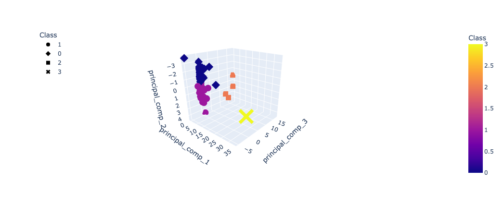
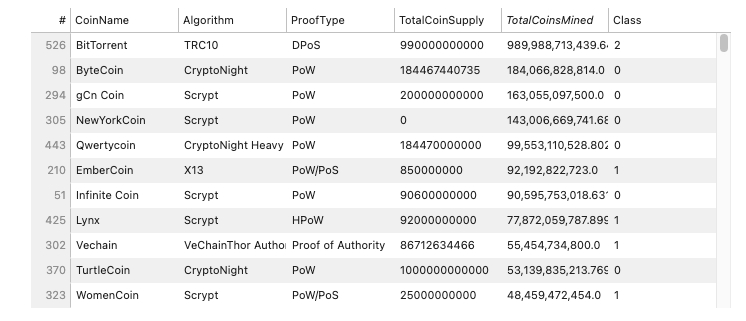
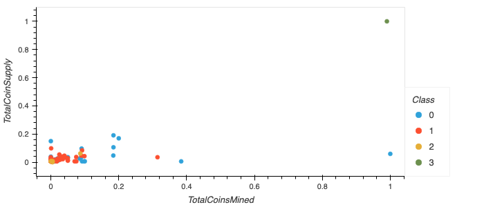

# Crypto_Analysis
Cryptocurrency Investment Analysis Using K-Means and Hierarchical Clustering with Unsupervised ML

## Purpose
Advisory Services Team at Accountability Accounting, is interested in offering a new cryptocurrency investment portfolio for its customers.
To do so I needed to process a crypto currency "Coin list" from [CrytpoCompare](https://min-api.cryptocompare.com/) api (a somewhat messy dataset) to fit the unsupervised machine learning models; and provide visualizations on the exploratory analysis on derived from those machine models. Specifically, analyze ccryptocurrencies are on the trading market currently and how they could be grouped to create a classification system for this new investment.

Tools utilized:
- pandas DataFrame to preprocess the data 
- PCA to reduce data dimensions
- K-means clustering ml models
- visualizations with Plotly Express and Pandas hvplot.

## Results
The visualizations created for further analysis:
#### 3D-Scatter Plot of PCA Principal Components

 

#### Table of Crypto Coins

#### 2D-Scatter of Scaled Coin Availability

